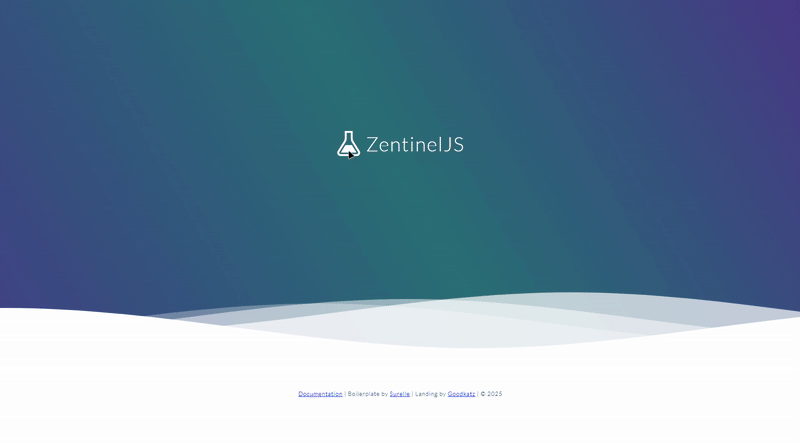

<div id="badges" align="center">
	<div align="center">
		<br><br>
	</div>
</div>

<div align="center">
	<h1 style="letter-spacing: 7px">VENDOR PAYMENT MANAGEMENT API</h1>
	<h3 style="letter-spacing: 7px">ZENTINEL.TS</h3>


</div>

Simple REST API using Node.js + Express + PostgreSQL for managing vendors and payments. This project uses my personal boilerplate called ZentinelTS; a TypeScript boilerplate that provides preset configurations and semi opinionated syntax. This enable users to develop Express server without building it from the scratch.

<div align="center">

</div>

## Project Overview - Vendor Payment Management API
This project is a RESTful API designed to manage vendors and their payments. It allows users to create, update, delete, and retrieve vendor information, as well as manage payments associated with those vendors. The API is built using Node.js and Express, with Sequelize as the ORM for database interactions.

## Technologies Used
- **Node.js**: JavaScript runtime for building scalable network applications.
- **Express**: Web framework for Node.js, providing robust features for building web and mobile applications.
- **PostgreSQL**: Relational database management system used for storing vendor and payment data.
- **Sequelize**: Promise-based Node.js ORM for PostgreSQL, providing an easy-to-use interface for database operations.
- **TypeScript**: Superset of JavaScript that adds static types, enhancing code quality and maintainability.
- **ZentinelTS**: A personal boilerplate that provides a structured and efficient way to build Express applications with TypeScript.
- **Redis**: In-memory data structure store used for caching and session management.

## Features
- **Vendor Management**: Create, update, delete, and retrieve vendor information.
- **Payment Management**: Create, update, delete, and retrieve payments associated with vendors.
- **Authentication**: Secure API endpoints with JWT-based authentication.
- **Authorization**: Role-based access control to restrict actions based on user permissions.

## Getting Started
To get started with the Vendor Payment Management API, follow these steps:
1. **Clone the Repository**: 
   ```bash
   git clone https://github.com/surelle-ha/vendor-payment-api.git
   ```
2. **Install Dependencies**:
   ```bash
   cd vendor-payment-api
   npm install
   ```
3. **Configure Environment Variables**: Create a `.env` file in the root directory and set the necessary environment variables, such as database connection details and JWT secret. Use the provided `.env.example` as a reference.
   ```bash
   cp .env.example .env
   ```
4. **Run Migrations**: 
   ```bash
   npm run db:reset
   ```
5. **Start the Server**:
   ```bash
   npm run start:local
   ```
6. **Validate the API accessibilty**: To check if the API is running, you can access the web UI at `http://localhost:8800/`. If you are able to see the ZentinelTS web UI, then the API is running successfully.
	
	

## API Documentation
This API documentation provides detailed information about the available endpoints, request parameters, and response formats.
> Postman exported file collection available at [Documentation Postman Collection](api-docs/Vendor-API.postman_collection.json).

- **Authentication** - To access protected endpoints, you need to authenticate using a JWT token. The token can be obtained
by logging in with valid user credentials. Include the token in the `Authorization` header of your requests.
  - `POST /auth/login`: Authenticate a user and retrieve a JWT token.
      - Request Body:
		```json
		{
		  "email": "admin@admin.com",
		  "password": "123123123",
		}
		```
	  - Response:
		```json
		{
			"status": "success",
			"message": "Successfully Authenticated.",
			"userData": {
				"user": {
					"id": "b4e89e06-4403-43...",
					"first_name": "Admin",
					"middle_name": "Admin",
					"last_name": "Admin",
					"email": "admin@admin.com",
					"email_verified": true,
					"status": "Active",
					"role_id": 1
				},
				"token": "eyJhbGciOiJIUzI1Ni...."
			}
		}
		```
  - `POST /auth/register`: Register a new user.
	  - Request Body:
		```json
		{
		  "first_name": "Admin",
		  "middle_name": "Admin",
		  "last_name": "Admin",
		  "email": "admin@admin.com",
		  "password": "123123123"
		}
		```
		- Validation Error: This will show if the request body does not meet the validation criteria.
		````json
		{
			"error": "Validation Error",
			"message": [
				{
					"type": "field",
					"msg": "Last Name is required",
					"path": "last_name",
					"location": "body"
				},
				{
					"type": "field",
					"msg": "Last Name must be at least 2 characters long",
					"path": "last_name",
					"location": "body"
				},
				{
					"type": "field",
					"msg": "Invalid email address",
					"path": "email",
					"location": "body"
				},
				{
					"type": "field",
					"msg": "Password is required",
					"path": "password",
					"location": "body"
				},
				{
					"type": "field",
					"msg": "Password must be at least 6 characters long",
					"path": "password",
					"location": "body"
				}
			]
		}
		````
  - `POST /auth/logout`: Logout account.
	  - Logout must have a valid JWT token in the `Authorization` header.
	  - Request:
	    ```shell
		curl --location --request POST 'http://localhost:8800/api/v1/auth/logout' \
		--header 'Authorization: ••••••' \
		--data ''
		```
- **Vendors**
  - `GET /vendors`: Retrieve a list of all vendors.
  - `POST /vendors`: Create a new vendor.
  - `GET /vendors/:id`: Retrieve a specific vendor by ID.
  - `PATCH /vendors/:id`: Update a specific vendor by ID.
  - `DELETE /vendors/:id`: Delete a specific vendor by ID.
  - `DELETE /vendors`: Delete all vendors.
  - `POST /vendors/:vendor_id/payments`: Assign payment for a specific vendor.
- **Payments**
  - `GET /payments/:id`: Retrieve a specific payment by ID.
  - `GET /payments`: Retrieve a list of all payments.
  - `POST /payments`: Create a new payment.
  - `PATCH /payments/:id`: Update a specific payment by ID.
  - `DELETE /payments/:id`: Delete a specific payment by ID.
  - `DELETE /payments`: Delete all payments.

## Project Structure
The project follows a modular structure, with separate directories for controllers, models, routes, validations, and middlewares. This organization helps maintain a clean and manageable codebase.	

```
# Vendor Payment Management API
# `src` is the root directory of the project.
# The project structure is as follows:
📦src
 ┣ 📂app
 ┃ ┣ 📂controllers
 ┃ ┃ ┣ 📜Auth.Controller.ts
 ┃ ┃ ┣ 📜Payment.Controller.ts
 ┃ ┃ ┣ 📜User.Controller.ts
 ┃ ┃ ┗ 📜Vendor.Controller.ts
 ┃ ┣ 📂exceptions
 ┃ ┃ ┗ 📜Common.Exception.ts
 ┃ ┣ 📂middlewares
 ┃ ┃ ┣ 📜Auth.Middleware.ts
 ┃ ┃ ┗ 📜Permission.Middleware.ts
 ┃ ┣ 📂models
 ┃ ┃ ┣ 📜Payment.Model.ts
 ┃ ┃ ┣ 📜Permission.Model.ts
 ┃ ┃ ┣ 📜Role.Model.ts
 ┃ ┃ ┣ 📜Role_Permission.Model.ts
 ┃ ┃ ┣ 📜Session.Model.ts
 ┃ ┃ ┣ 📜User.Model.ts
 ┃ ┃ ┣ 📜Vendor.Model.ts
 ┃ ┃ ┗ 📜Vendor_Payment.Model.ts
 ┃ ┣ 📂routes
 ┃ ┃ ┣ 📂api
 ┃ ┃ ┃ ┗ 📂v1
 ┃ ┃ ┃ ┃ ┣ 📜Auth.Route.ts
 ┃ ┃ ┃ ┃ ┣ 📜Payment.Route.ts
 ┃ ┃ ┃ ┃ ┣ 📜User.Route.ts
 ┃ ┃ ┃ ┃ ┣ 📜Vendor.Route.ts
 ┃ ┃ ┃ ┃ ┗ 📜Webhook.Route.ts
 ┃ ┃ ┗ 📂web
 ┃ ┃ ┃ ┗ 📜Home.Route.ts
 ┃ ┗ 📂validations
 ┃ ┃ ┣ 📜Auth.Validation.ts
 ┃ ┃ ┣ 📜Payment.Validation.ts
 ┃ ┃ ┗ 📜Vendor.Validation.ts
 ┣ 📂config
 ┃ ┣ 📜app.ts
 ┃ ┣ 📜bootstrap.ts
 ┃ ┣ 📜cache.ts
 ┃ ┣ 📜compress.ts
 ┃ ┣ 📜cors.ts
 ┃ ┣ 📜database.ts
 ┃ ┣ 📜exception.ts
 ┃ ┣ 📜helmet.ts
 ┃ ┣ 📜logger.ts
 ┃ ┣ 📜mailer.ts
 ┃ ┣ 📜maintenance.ts
 ┃ ┣ 📜prometheus.ts
 ┃ ┣ 📜ratelimit.ts
 ┃ ┣ 📜redis.ts
 ┃ ┣ 📜socket.ts
 ┃ ┗ 📜storage.ts
 ┣ 📂database
 ┃ ┣ 📂factories
 ┃ ┃ ┗ 📜User.Factory.js
 ┃ ┣ 📂migrations
 ┃ ┃ ┣ 📜00000000000000-create-role.js
 ┃ ┃ ┣ 📜00000000000001-create-user.js
 ┃ ┃ ┣ 📜00000000000002-create-session.js
 ┃ ┃ ┣ 📜00000000000003-create-permission.js
 ┃ ┃ ┣ 📜00000000000004-create-role-permission.js
 ┃ ┃ ┣ 📜00000000000005-create-vendor.js
 ┃ ┃ ┣ 📜00000000000006-create-payment.js
 ┃ ┃ ┗ 📜00000000000007-create-vendor-payment.js
 ┃ ┗ 📂seeders
 ┃ ┃ ┣ 📜00000000000000-demo-roles.js
 ┃ ┃ ┣ 📜00000000000001-demo-users.js
 ┃ ┃ ┣ 📜00000000000002-demo-permissions.js
 ┃ ┃ ┗ 📜00000000000003-demo-rolepermissions.js
 ┣ 📂declaration
 ┃ ┗ 📜framework.d.ts
 ┣ 📂public
 ┃ ┣ 📂css
 ┃ ┃ ┗ 📜style.css
 ┃ ┣ 📂js
 ┃ ┃ ┗ 📜socket.js
 ┃ ┗ 📜index.ejs
 ┣ 📂storage
 ┃ ┣ 📂docs
 ┃ ┃ ┣ 📂_astro
 ┃ ┃ ┣ 📂guides
 ┃ ┃ ┣ 📜404.html
 ┃ ┃ ┣ 📜favicon.svg
 ┃ ┃ ┗ 📜index.html
 ┃ ┣ 📂logs
 ┃ ┃ ┣ 📜error.log
 ┃ ┃ ┣ 📜fatal.log
 ┃ ┃ ┣ 📜info.log
 ┃ ┃ ┗ 📜warn.log
 ┃ ┗ 📂sequelize-ui
 ┗ 📜server.ts
```
## About ZentinelTS

Below are the features of Zentinel.TS:

- Interconnected MVC Components
- Sequelize UI / ORM Code Generator

## Installation

## Developer

As a developer who constantly seeks to improve my development skills, my goal with Zentinel.TS is to create a powerful yet intuitive backend boilerplate that simplifies the development process for fellow developers. I aim to provide a toolset that makes backend operations more efficient and enjoyable, ensuring that developers can focus on building great applications without getting bogged down by repetitive tasks.

I envision Zentinel.TS as a go-to boilerplate for developers who appreciate the structure and convenience of Laravel but prefer to work within the Node.js ecosystem. By combining the best aspects of both worlds, I hope to foster a community where developers can share their experiences, contribute to the project's growth, and continuously improve their craft. Ultimately, Zentinel.TS will empower developers to create scalable, secure, and high-performance applications with ease, making backend development more accessible and enjoyable for everyone.

# Contributing to Zentinel.TS

We appreciate your interest in contributing to our project. Zentinel.JS aims to provide a powerful and intuitive backend boilerplate, and contributions from developers like you help us achieve and maintain this goal.

## Quick Start for Contributors

To get started, here’s what you need to know:

### Code of Conduct

We prioritize creating a respectful and inclusive environment. Please review and adhere to our Code of Conduct to ensure a positive experience for all collaborators.

### Reporting Bugs

If you find a bug in the codebase:

1. **Check Existing Issues:** Verify if the issue has already been reported to avoid duplication.
2. **Create a Detailed Issue:** Include a descriptive title, a clear explanation of the problem, steps to reproduce, and the expected outcome.

### Feature Requests

To suggest a new feature:

1. **Search Existing Suggestions:** Check if someone else has already proposed something similar.
2. **Submit a New Issue:** Clearly describe the proposed feature, its benefits, and possible implementations.

## How to Contribute Code

### Setting Up Your Development Environment

1. **Fork the Repository:** Start by forking the Zentinel.JS repository on GitHub.
2. **Clone Your Fork:** Clone your forked repository to your local machine.
3. **Install Dependencies:** Navigate to the project directory and run `npm install` to install required dependencies.

### Making Changes

1. **Create a New Branch:** Use a branch specific to the feature or fix you are working on.
2. **Commit Changes:** Make your changes in the new branch. Commit messages should clearly explain the purpose of the changes.
3. **Write Tests:** Add or update tests to cover the new functionality or fixes. Ensure all tests pass.

### Pull Request Process

1. **Update Your Branch:** Rebase your branch on the latest main branch to ensure a smooth integration.
2. **Submit a Pull Request (PR):** Push your branch to GitHub and open a PR against the main branch of the original Zentinel.JS repository.
3. **Review Process:** The project maintainer will review your PR. Be open to making revisions based on feedback.
4. **PR Approval and Merge:** Once approved, the maintainers will merge your PR.

## Additional Resources

- **Documentation:** Familiarize yourself with the project documentation to understand how to use and extend Zentinel.JS.
- ~~**Community:** Join our community forums or chat channels to discuss ideas and ask questions.~~

## Acknowledgments

Contributors who help improve Zentinel.JS make a significant impact. We appreciate your dedication and effort in enhancing this project.

Thank you for choosing to contribute to Zentinel.JS. We look forward to your contributions!

<a href="https://github.com/surelle-ha/zentineljs/graphs/contributors">

</a>


# 


